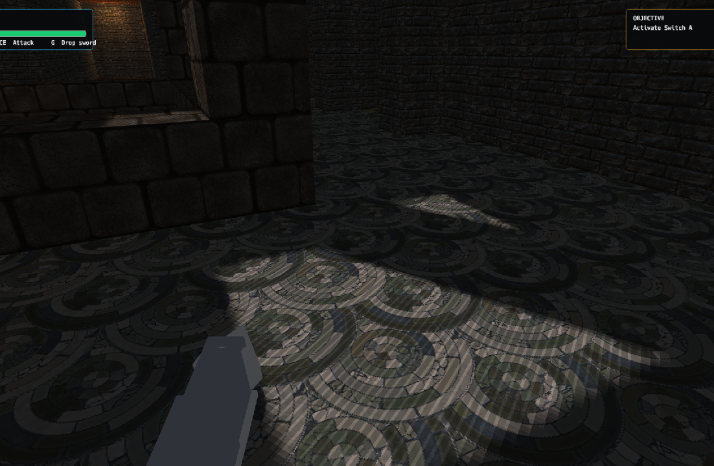
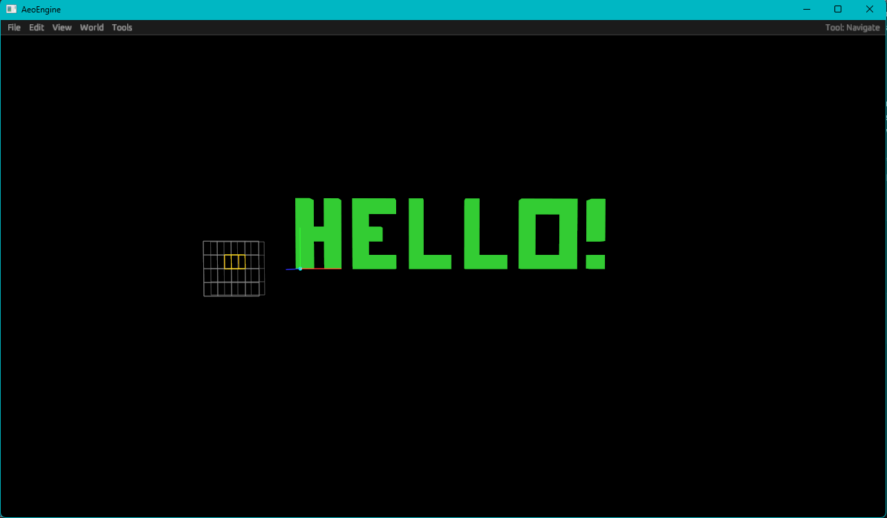
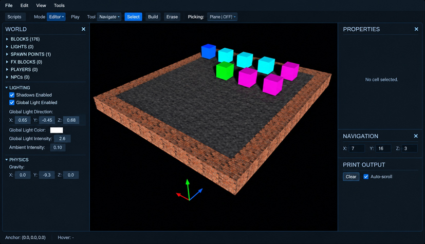

# AeoEngine

> **Build. Script. All in one.**
>
> The screenshots below show active AeoEngine development.

<p align="center">
  
</p>

AeoEngine is an all-in-one 3D voxel game engine, editor, and scripting environment written in Rust. It brings world editing, entity management, gameplay scripting (AeoScript), playtesting, and standalone game packaging into a single unified workspace.

**BUILD → SCRIPT → PLAY → RELEASE**

No separate level editor. No separate gameplay tool. 

---

## Start with the scene itself.

Place blocks. Shape spaces. Select and move parts of the world. Organize the project. Add project-owned textures and assets. 

<table>
<tr>
<td width="50%">

</td>
<td width="50%">

</td>
</tr>
<tr>
<td align="center"><strong>THE EDITOR</strong></td>
<td align="center"><strong>THE WORLD</strong></td>
</tr>
</table>

---

## Add Actors

A game needs things that can do something.

Actors are objects with their own transforms, packages, physics settings, attributes, and script bindings.

<p align="center">
  
</p>

Characters, switches, props, interactive objects, and other authored pieces can live alongside the voxel world without pretending to be blocks.

The Project Explorer keeps those pieces organized as the scene grows.

<p align="center">
  
</p>

---

## AeoScript is the gameplay language built for AeoEngine.

Write scripts in the same workspace via built in script editor / IDE setup. (WIP)

<p align="center">
  
</p>

AeoScript can currently drive small gameplay systems, Actor behavior, input, events, UI, audio, animation, runtime state, and reusable Modules.

```aeoscript
debug.log("Game script loaded")

gold: number = 0

on on_gold(amount) {
    gold += amount
}
```

Attach behavior to the things in the world, or write standalone systems that coordinate the game around them.

---

AeoEngine keeps runtime output visible in the editor so behavior can be tested while the project is running. (WIP)

<p align="center">
  
</p>

Run the scene. Trigger the interaction. Read the output. Change the script. Run it again.

That loop is the point.

---

## Then build the game


AeoEngine can package projects for the separate `aeogame` runtime so a game can launch independently of the editor.


```text
Create project
      ↓
Build world
      ↓
Add Actors
      ↓
Code
      ↓
Play
      ↓
Build 
```

---

# It did not start here

AeoEngine began much smaller.

### The first world

<p align="center">
  
</p>

### The first AeoScript editor

<p align="center">
  
</p>

And later, the 0.7.x editor:

<p align="center">
  
</p>

The engine is still being built, but the direction is visible:

**from placing blocks → to building projects → to making games.**

---

## Try AeoEngine

AeoEngine currently targets Windows but is planning to release on multiple platforms 

**Public releases are beta builds.** They are provided for testing and experimentation and are not guaranteed to work correctly on every system or with every project.

[**Download AeoEngine →**](https://aeowun.com/downloads/)

A release can also be downloaded directly from the repository's **Releases** tab.

[Documentation](https://aeowun.com/docs/) · [Getting Started](https://aeowun.com/aeoengine/getting-started/) · [AeoScript](https://aeowun.com/aeoscript/)

---

<sub>AeoEngine is under active development. Features, APIs, editor behavior, project formats, and runtime behavior may change between beta releases.</sub>
